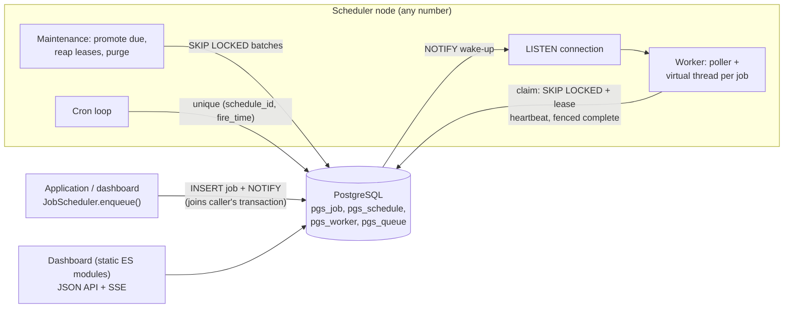
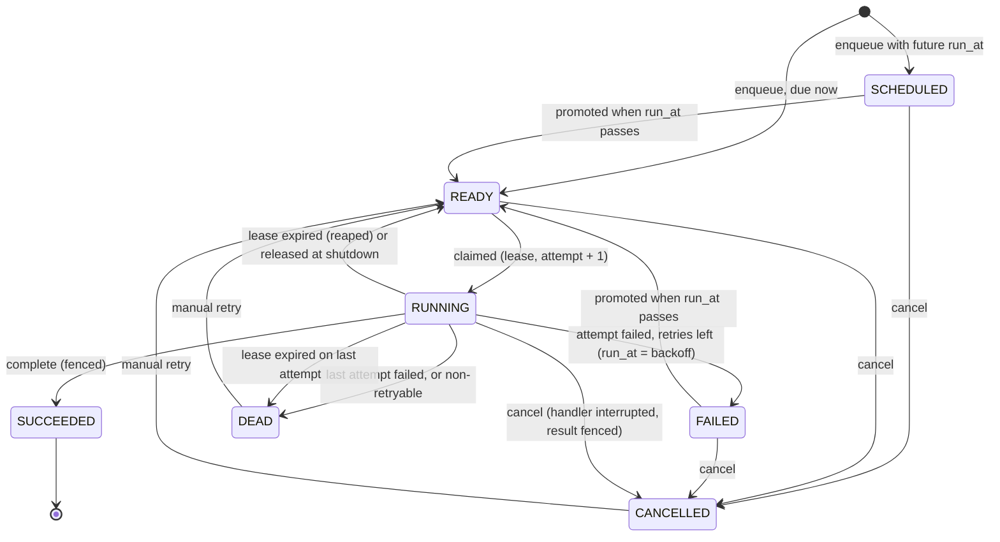

# pg-scheduler

A distributed job scheduler that uses PostgreSQL as its only infrastructure: delayed, retried and cron jobs live in
tables, any number of workers claim them with `SELECT ... FOR UPDATE SKIP LOCKED`, and a lease with fencing makes a
crashed worker's jobs run elsewhere without letting the dead worker's late result overwrite anything. It ships as a
Spring Boot library (`pg-scheduler-core`, auto-configured) and a server (`pg-scheduler-server`) with an admin
dashboard and demo handlers. No Quartz, no Redis, no message broker; the cron parser and next-fire-time calculator are
written from scratch.

[](https://github.com/mgeladzerezo/pg-scheduler/actions/workflows/ci.yml)

## Status of verification (read this first)

The tests were run on earlier revisions of this code, not on its final form. The table says exactly what that covers.

| Item | State |
| --- | --- |
| `pg-scheduler-core` test suite (134 tests: queue, contention, crash recovery, fencing, shutdown, retries, wake-up, cron, DST, property oracle) | Ran green earlier, on the code as of commit `test(core): contention, crash recovery, ...`. |
| `AutoConfigurationTest` (3 tests) and `DashboardApiTest` (5 tests, whole server on Testcontainers Postgres) | Ran green earlier, when they were written. |
| Docker image, `docker compose up --build`, three workers, `docker kill` hand-over | Built and started once, and the hand-over was observed by hand (see "Demo script"). The final `Dockerfile` edit (curl line formatting), the CSS and `api.js` tweaks and everything after were **not** rebuilt or re-run. |
| Dashboard UI | Overview page looked at once in a headless browser. The other pages (jobs, job detail, dead letters, workers, schedules) were never rendered. The last two UI edits were never run. |
| Benchmarks, `EXPLAIN` output | **Not measured in the final state.** See "Performance" and `docs/claim-plan.md`. |
| `./mvnw verify` from a clean checkout | Not yet run on the final revision. |

## Architecture



Every role is optional and independent per process: a web app that only enqueues, a worker process, one or more
processes running cron. Any mix shares one database.

## Quick start

```
docker compose up --build
```

Then open <http://localhost:8207> (login `admin` / `admin`; set `DASHBOARD_PASSWORD` to change it). Compose starts
PostgreSQL 16, one server container (dashboard, cron, demo data) and three worker containers. Postgres is also on host
port 5547. Seeded schedules fire every minute, every two minutes and so on, and the server enqueues a demo job every
two seconds: email sends, a flaky job that fails half its attempts (watch the backoff), a slow job, and a job that
always fails (watch it end in Dead letters, then press Retry).

### Demo script: kill a worker

1. Jobs page, "Enqueue a job by hand": type `slow.job`, payload `{"seconds": 45}`.
2. Open the job: `Locked by` shows which worker runs it, for example `worker-3`.
3. `docker kill pg-scheduler-worker-3`.
4. Within one lease (15 s in compose) the job's attempt timeline shows attempt 1 as `lease expired` on worker-3 and
   attempt 2 running on another worker, which finishes it.

Run once by hand with exactly these steps; the job was taken over by `worker-1` and finished with attempts
`[1: worker-3 LEASE_EXPIRED, 2: worker-1 SUCCEEDED]`.

Without Docker: start PostgreSQL, set `DB_URL`, `DB_USER`, `DB_PASSWORD` and run
`./mvnw -pl pg-scheduler-server -am package` then `java -jar pg-scheduler-server/target/pg-scheduler-server-*.jar`.

## Using the library

```java
@Component
class Emails {
    record EmailPayload(String to, String subject) {}

    @JobHandler(value = "email.send", maxAttempts = 5, timeout = "30s", noRetryFor = InvalidAddress.class)
    void send(EmailPayload payload, JobContext context) { ... }      // typed payload, optional context
}

// or: implements JobHandler<EmailPayload> { String jobType(); void handle(EmailPayload, JobContext) }

@Transactional
void placeOrder(Order order) {
    orders.save(order);
    jobs.enqueue(JobRequest.of("email.send", new EmailPayload(order.email(), "Thanks")));  // same transaction
}
```

`pgscheduler.*` properties (see `PgSchedulerProperties`) switch the worker, maintenance, cron and LISTEN roles on and off
and set queues with their concurrency, lease, batch size, and per-job-type retry policy. Precedence for a job type:
library default, `pgscheduler.defaults`, `@JobHandler` attributes, `pgscheduler.job-types.<type>`.

## How it works

### 1. Claiming without a lock held for the job's duration

[`WorkerDao.CLAIM`](pg-scheduler-core/src/main/java/io/github/mgeladzerezo/pgscheduler/store/WorkerDao.java), line by line:

* `WHERE state = 'READY' AND queue = ? AND type = ANY (?)`: only jobs due now (promotion moved them to READY) on queues
  and types this worker serves. Unknown job types are never claimed, so they stay READY ("parked") until a worker that
  knows the type joins.
* `NOT EXISTS (... pgs_queue ... paused)`: a paused queue yields nothing; running jobs finish.
* `ORDER BY priority DESC, run_at, id LIMIT ?`: higher priority first, then oldest due time. The partial index
  `pgs_job_claim_idx (queue, priority DESC, run_at, id) WHERE state = 'READY'` is in exactly this order.
* `FOR UPDATE SKIP LOCKED`: lock the rows being taken and step over rows another claimer holds locked, so concurrent
  workers never block each other and never take the same row.
* `UPDATE ... SET state = 'RUNNING', attempt = attempt + 1, locked_by, locked_until = now() + lease`: in the same
  statement, so the transaction is one short statement. When it commits the row locks are gone; ownership is now the
  **lease**, not a database lock.

Why a lease and not a row lock held while the handler runs: a held lock pins a connection and a transaction for as long
as the job runs (minutes), blocks vacuum, and still gives no answer when the worker dies mid-job in a way that leaves the
connection open (a frozen process, a network partition). A lease expires by time, any node can observe that, and the
attempt counter makes the owner unambiguous.

### 2. Leases, heartbeats and fencing

A worker extends the leases of its running jobs on a heartbeat (a third of the lease). The reaper (running on every node,
`SKIP LOCKED`) returns jobs whose lease expired to READY, or to DEAD if that was the last attempt. The attempt was
already counted at claim time, so a job that crashes its worker every time cannot loop forever.

A worker that lost its lease can still be alive (paused, partitioned). It must not be able to record a result. Every
statement that ends an attempt (`COMPLETE`, `FAIL`, heartbeat) is conditional:
`WHERE id = ? AND state = 'RUNNING' AND locked_by = ? AND attempt = ?`. After a reap the state or attempt differs, so
the late write changes zero rows, and the worker discards the result and logs a fenced completion. A worker that cannot
heartbeat for a whole lease interrupts its own handlers. Graceful shutdown stops claiming, waits for running handlers up
to a timeout, then releases what is left without counting an attempt.

### 3. Cron

[`CronExpression`](pg-scheduler-core/src/main/java/io/github/mgeladzerezo/pgscheduler/cron/CronExpression.java) is a
hand-written 5-field parser and calculator. Supported: lists, ranges (also wrapping, `FRI-MON`), steps, month and day
names, `L` and `L-n` in day-of-month, `5L` and `1#2` in day-of-week, `?`, and the usual `@macros`. Rejected at parse
time: seconds and year fields, `W`, `LW`, bare `L` in day-of-week, `@reboot`. With both day fields restricted a date
matches when either does (Vixie cron).

DST, defined and tested: a wall-clock time inside a spring-forward gap fires once at the first instant after the gap
(never skipped, never doubled); a time repeated by a fall-back overlap fires once on its first occurrence, except
schedules that run every hour, which keep their real-time cadence through both passes.

Schedules live in `pgs_schedule`. Several instances may run the cron loop: each locks due schedules with `SKIP LOCKED`
and inserts the job in the same transaction that advances `next_fire_time`; a unique index on `(schedule_id, fire_time)`
is the backstop even if a row is rewound by hand. Misfire policy (a fire time noticed later than the threshold, 60 s by
default): `FIRE_ONCE` (default: one job for the latest missed time), `SKIP` (drop missed times), `CATCH_UP` (enqueue
every missed time, bounded per pass). A paused schedule resumes from now and does not make up for the pause.

### 4. Delivery guarantee

**At-least-once execution.** Exactly-once is not achievable for handlers with outside side effects: if a worker dies
after the side effect and before the completion, the job runs again. What the library guarantees: a job is *claimed* by
one worker at a time; the result of a stale attempt is never recorded; a committed job is never lost. What it gives
handlers to be idempotent: `JobContext.jobId()` and `attempt()` (a natural idempotency key), `isLastAttempt()`, an
interrupt when the lease is lost, the timeout elapsed or shutdown begins, and `uniqueKey` de-duplication at enqueue time.
Enqueue itself is transactional, so "job exists if and only if the business change commits" holds.

### Job lifecycle



## Performance

Expected claim plan and the index design: [docs/claim-plan.md](docs/claim-plan.md) (expected shape, **not** captured
output).

| Measurement | Command | Result |
| --- | --- | --- |
| Exactly-once load: 8 worker pools, 20,000 short jobs, jobs/second | `./mvnw -B -pl pg-scheduler-core test -Dtest=ExactlyOnceClaimTest` (prints a line `EXACTLY_ONCE_LOAD ... jobs_per_second=`, in the surefire output file) | not yet measured |
| Enqueue-to-start latency via NOTIFY | `./mvnw -B -pl pg-scheduler-core test -Dtest=NotifyWakeUpTest` | not yet measured (the test asserts a bound, it does not report a figure) |
| Claim plan with 3,000,000 finished rows | `./mvnw -B -pl pg-scheduler-core -Pbench test -Dtest=ClaimPlanTest` | not yet measured |

## Design decisions

* **Plain JDBC on the queue path.** The claim, complete, fail, heartbeat and reap statements are hand-written SQL
  with exact control over locking and the fence; an ORM would hide the one thing that matters. Spring is used for
  transaction joining (`DataSourceUtils`), auto-configuration and handler discovery.
* **Partial indexes.** One per access path (claim, due, lease, dead, purge, unique key, fire time) rather than one
  wide index; each holds only the rows that path needs, so none grows with history.
* **Attempt counted at claim, not at failure.** A crash is an attempt. Trades one lost retry for a hard bound on
  poison jobs.
* **Own migration history table (`pgs_schema_history`)** so the library cannot collide with the host app's Flyway.
* **Maintenance on every node, not a leader.** Promotion, reaping and purge all use `SKIP LOCKED` batches, so there is
  no election to get wrong; nodes share the work.
* **LISTEN/NOTIFY plus polling.** NOTIFY is a latency optimisation delivered at commit; losing the connection degrades
  to polling and reconnects. Correctness never depends on it.
* **Cluster-wide queue concurrency limit** is checked under a per-queue advisory lock, since two claimers could each
  see "limit - 1 running" and both take a job.
* **Auth is one HTTP Basic admin account in a servlet filter**, not Spring Security: small, enough for an admin demo,
  and the browser handles credentials for `fetch` and `EventSource`.
* **Rejected: advisory-lock-per-job** (many locks, session-bound, bad with pooling) and **row locks held for the job
  duration** (see above).

## Comparison

| | pg-scheduler | Quartz | db-scheduler | JobRunr |
| --- | --- | --- | --- | --- |
| Storage | PostgreSQL only | any JDBC DB, clustered by row locks | any JDBC DB | SQL and NoSQL |
| Maturity | new, small | very mature | mature | mature |
| Cron | own parser, tested against an oracle | the reference implementation: seconds, calendars, many misfire instructions | via Cron-utils style trigger | yes |
| Dashboard | yes, small | none built in | none (third-party) | rich, polished |
| Notable | lease + fencing, transactional enqueue, NOTIFY wake-up | calendars, listeners, huge feature set | tiny, simple, long-tested | fire-and-forget lambdas, batches, Pro features |

Where the others are better: Quartz has far more scheduling features (calendars, seconds-level cron, years of production
hardening) and supports every major database. db-scheduler is much smaller and has been run in production by many teams;
JobRunr has lambda-based enqueueing without handler classes and a more mature dashboard and ecosystem. This project is
narrower on purpose (PostgreSQL only) and in exchange uses SKIP LOCKED, partial indexes and NOTIFY directly.

## Testing

All Docker-dependent tests use Testcontainers PostgreSQL 16 (`postgres:16-alpine`). Status of each is in the table above.

| Test | Proves |
| --- | --- |
| `ExactlyOnceClaimTest` | 8 worker pools on separate DataSources race over 20,000 jobs; each runs once (unique-constraint table, counters, attempt rows), none left behind |
| `CrashRecoveryTest` | a worker in a separate OS process is killed mid-job; another worker re-runs it after the lease expires |
| `FencingTest` | a partitioned worker's late completion is rejected; stale attempts cannot complete, fail or extend; cancelling interrupts and fences |
| `GracefulShutdownTest` | stop waits for handlers and claims nothing new; overdue handlers are interrupted and their jobs released |
| `NotifyWakeUpTest` | a job starts within milliseconds although polling is 30 s; losing the LISTEN connection degrades to polling and recovers |
| `RetryAndTimeoutTest` | backoff schedule, FAILED state with a future run time, dead-lettering and manual retry, non-retryable errors, timeout interrupts the handler |
| `ConcurrencyAndRateLimitTest` | per-worker and cluster-wide queue limits; rate limit across workers |
| `EnqueueTest`, `TransactionalEnqueueTest` | defaults, delays, de-duplication (also under concurrent enqueue), bulk enqueue; rollback discards the job, no worker sees it before commit |
| `WorkerExecutionTest` | typed and generic payloads, priority order, delays, queue pause, parking of unknown types, chaining |
| `ClaimPlanTest` | claim, promote and reap use the partial indexes with 300,000 finished rows (3,000,000 under `-Pbench`) |
| `CronExpressionTest`, `CronDstTest` | syntax, rejection of bad input, DST gap and overlap rules in several zones |
| `CronPropertyTest` | random expressions agree with a minute-by-minute brute-force oracle sharing no code with the implementation, including windows around every DST transition of eight zones |
| `CronSchedulerTest` | three scheduler instances with an injected clock fire each fire time exactly once; the three misfire policies; pause and resume |
| `BackoffTest` | exponential growth, cap, jitter only shortens |
| `AutoConfigurationTest` | handler discovery, generics, policy precedence, roles off |
| `DashboardApiTest` | authentication, API flows (enqueue, result, attempts, dead letter retry, conflict and 404, schedules, validation), SSE, Prometheus meters |

Meters: `pgscheduler.queue.depth`, `pgscheduler.job.latency`, `pgscheduler.job.duration`, `pgscheduler.job.failures`,
`pgscheduler.lease.expirations`, `pgscheduler.completions.fenced`, `pgscheduler.jobs.released`, at `/actuator/prometheus`.

## Known limitations

* The test suite was written and run earlier, but **not executed in this final pass**; nothing written after that point is verified by running. Docker was shut down, so the image and compose file were not rebuilt after the
  last edits and `./mvnw verify` was not run from a clean checkout.
* Only the overview page of the dashboard was rendered and looked at; the other pages are untested by any browser and
  have no automated UI tests.
* No benchmark figure is reported; see the Performance table.
* The `EXPLAIN` output in the docs is the expected shape, not captured output.
* A large block of READY jobs of a type no worker handles, at the front of a queue's claim order, is read past by the
  `type = ANY` filter on every claim.
* Cron has no seconds field, no calendars and no year field. Schedules cannot be edited in the dashboard, only created,
  paused, triggered and deleted.
* Job batches with a completion callback are not implemented; chaining (`JobRequest.then`) is.
* Authentication is a single shared admin account over plain HTTP Basic; put TLS in front of it.
* PostgreSQL only; tested against 16.
* The LISTEN connection is opened from `spring.datasource.*` when those properties exist, otherwise one pooled
  connection is taken for good.
